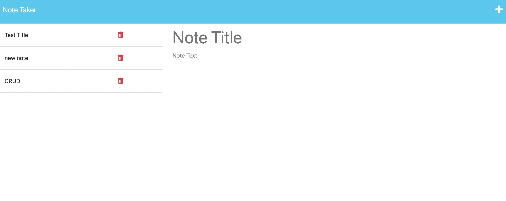
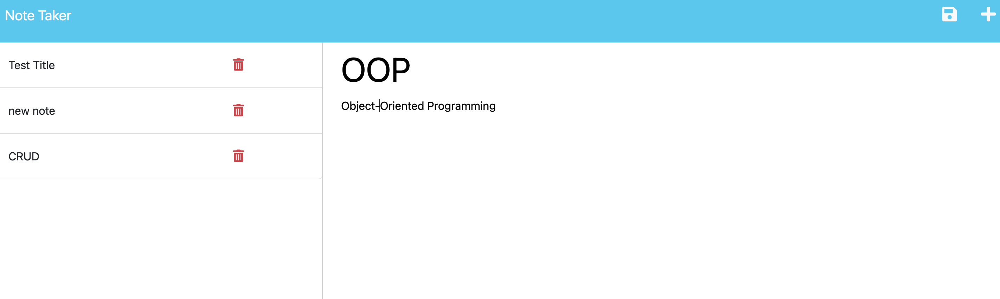
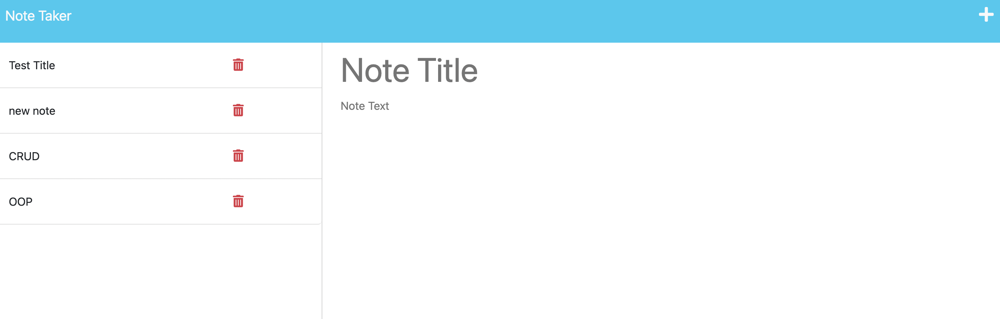

# note-taker

## Description

Business owners, web developers, students, and even parents can be very busy people. They have a million things to do, another million reminders, and countless thoughts. It is hard to keep track of all these things and not forget something. After all, we are human and making errors is almost in our DNA. This application grants busy people a method to quickly write down their note and save it. Now, anytime a user forgets what they have to do, they can go to this application and see what notes they took about what they have to do or remember. The application is easy to use in that once the first note is made, another note is easy to make because all the user has to do is click on the plus icon, navigate to the textbox and click on the title part to add title and click on description box to add their note. Then all they have to do is click on the save icon and all the notes will appear on the left. This application solves the problem of people forgetting what they have to do and helps users be more organized. Through this project, I learned how to make post requests and use express. 

## Table of Contents 

- [Installation](#installation)
- [Usage](#usage)
- [Credits](#credits)
- [License](#license)

## Installation

To use this application, all the user needs is a url. 

## Usage

When the user clicks on the note taker link, they will be prompted to a page that says "Note Taker" and a blue button that says "get started". This will only appear to the user if they have no notes made. Once the user clicks on the "get started" button, they will be prompted to a page that has a textbox that covers 3/4ths of the page on the right hand side. The user will insert a note title by clicking on that section. The user will then put in their note text on the textbook that says that. Once the note is done, they will click on the save button that is on the top right of the page. The new note will then appear on the left hand side of the page with the title showing. A user can click on these notes to look at their content whenever they want. The user can make more notes by using the "plus" icon on the top right of the page. 

At this moment, the user cannot delete notes. That is more future development. 

The first image shows the slate for where to put in a new note by clicking the plus icon.
The second image shows an example of a note being written.
The third image shows that note being saved on the left-hand side. 

## Credits

Followed code format of UCLA Bootcamp, Unit 11, Activity 20

## License

Refer to Github repository.

Deployed link: https://desolate-shelf-97014.herokuapp.com/
